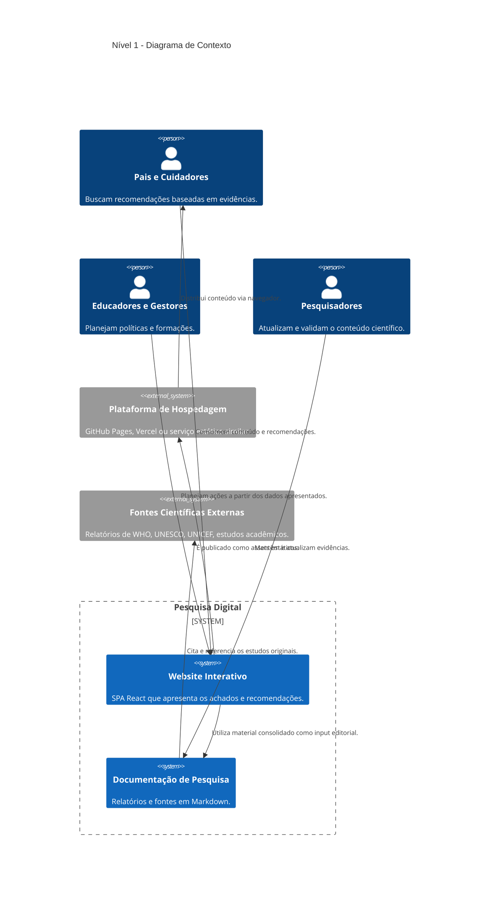
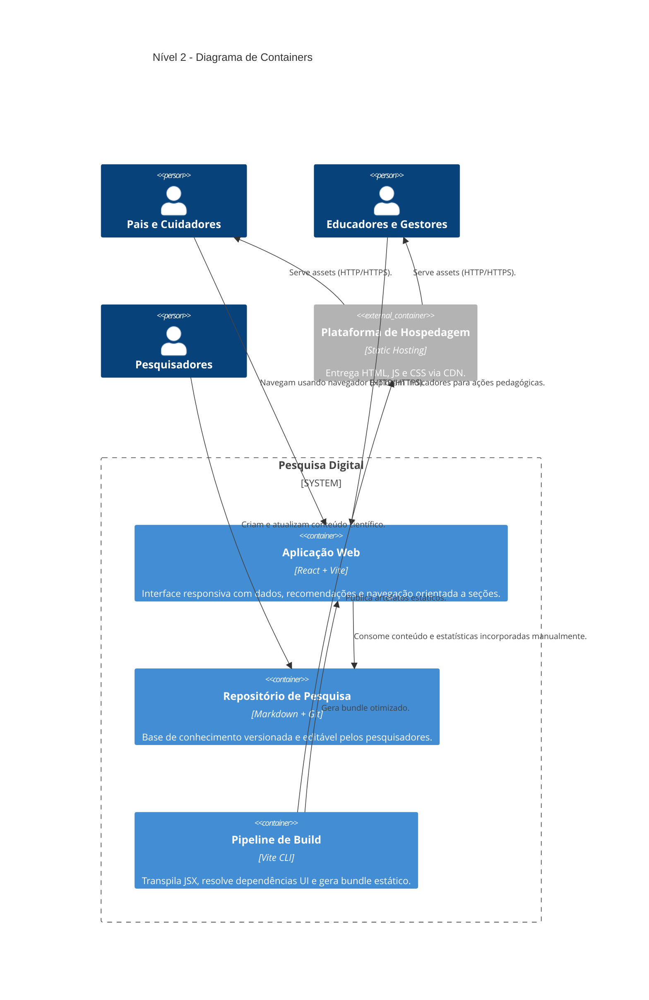
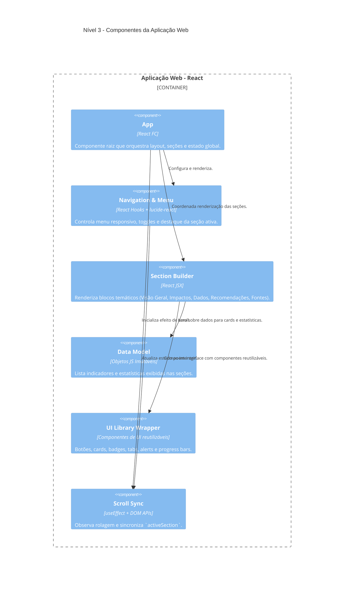

## Documento de Arquitetura

### Visão Geral
- **Sistema**: `Pesquisa Digital`
- **Domínio**: Divulgação científica sobre impacto de telas e redes sociais em crianças e adolescentes.
- **Público-alvo**: Pais, educadores, formuladores de políticas e pesquisadores.
- **Artefatos principais**:
  - `website/`: aplicação web interativa construída em React.
  - `pesquisa/`: documentação científica em Markdown.
  - `apresentacoes/`: materiais de apoio para treinamentos e workshops.

### Objetivos Arquiteturais
- Entregar conteúdo científico de forma acessível e responsiva.
- Permitir evolução incremental do conteúdo sem exigir backend dedicado.
- Facilitar publicação estática (GitHub Pages, Vercel ou similar).
- Promover reuso de conteúdo entre website, relatórios e apresentações.

### Requisitos
- **Funcionais**:
  - Disponibilizar seções temáticas (`hero`, `overview`, `impacts`, `data`, `recommendations`, `sources`) com dados consolidados.
  - Permitir navegação fluida com destaque da seção ativa durante o scroll.
  - Exibir estatísticas chave e recomendações baseadas em evidências.
- **Não Funcionais**:
  - `Responsividade`: layout adaptável a dispositivos móveis e desktop.
  - `Performance`: assets estáticos otimizados via bundler (Vite).
  - `Observabilidade`: simplicidade de troubleshooting, dado que não há backend.
  - `Escalabilidade de conteúdo`: inclusão de novos dados via Markdown e componentes React.

### Stack Tecnológica
- **Frontend**: React 18 (SPA), hooks (`useState`, `useEffect`), ícones `lucide-react`.
- **UI Kit**: componentes reutilizáveis (botões, cards, tabs, alerts, badges) importados de `@/components/ui`.
- **Bundler**: Vite (referenciado por `index.html` via `/src/main.jsx`).
- **Dados**: conteúdo editorial em Markdown (`pesquisa/`) consumido manualmente para o front.
- **Controle de versão**: Git + GitHub.

### Estrutura de Pastas Relevante
- `website/index.html`: ponto de entrada, injeta `App.jsx`.
- `website/App.jsx`: define a SPA, seções e dados exibidos.
- `pesquisa/*.md`: fontes, análises e estudos que alimentam o conteúdo.
- `apresentacoes/google-family-link/*.html`: materiais de apoio.

### C4 - Nível 1 (Contexto)

### C4 - Nível 2 (Containers)

### C4 - Nível 3 (Componentes da Aplicação Web)

### Decisões Arquiteturais Notáveis (ADR)
- **SPA estática**: elimina necessidade de backend, facilita hospedagem gratuita. Impacto: dependência do conteúdo ser acoplado ao código.
- **Dados embeddings no código**: simplifica build inicial; plano futuro é automatizar ingestão dos arquivos Markdown.
- **UI padronizada**: uso de componentes UI dedicados melhora consistência visual, mas exige importação correta (ausentes no repositório atual).
- **Estratégia de publicação**: build Vite + deploy automático via GitHub Actions (a ser configurado) garante atualização contínua.

### Riscos e Mitigações
- **Dependências UI externas ausentes** (`@/components/ui`): documentar origem e incluir submódulo ou pacote antes do próximo deploy.
- **Fonte de dados manual**: risco de inconsistência entre Markdown e SPA; mitigar com scripts de sincronização.
- **Acessibilidade**: elementos visuais ricos precisam de verificação de contraste e navegação por teclado.
- **Escalabilidade de conteúdo**: seções monolíticas em `App.jsx` podem se tornar difíceis de manter; modularização futura recomendada.

### Próximos Passos Técnicos
- Configurar pipeline de CI/CD com lint, testes básicos de renderização e deploy estático.
- Extrair cada seção de `App.jsx` para componentes dedicados (`HeroSection`, `OverviewSection`, etc.).
- Automatizar ingestão de dados a partir dos arquivos `pesquisa/*.md` (build-time parsing).
- Adicionar testes de interface (Playwright ou Testing Library) para validar navegação e exibição de métricas.
- Incorporar métricas de acessibilidade (Lighthouse, axe-core) e analytics anônimos.
